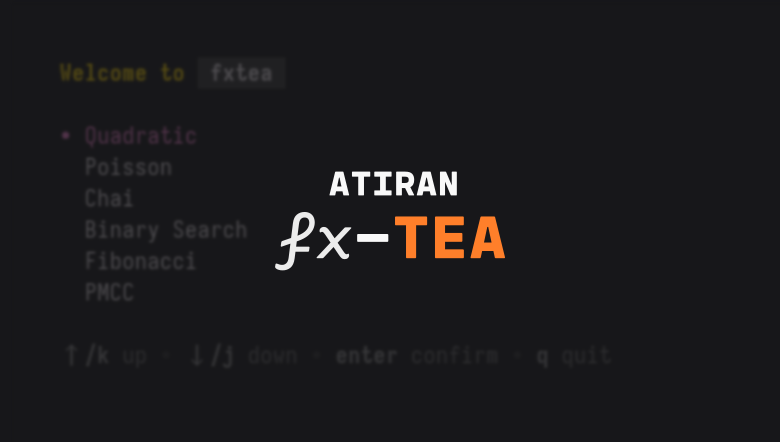

# fxtea
An advanced calculator extended from [devraza](https://git.devraza.giize.com/devraza)'s
[A-Level utilities](https://git.devraza.giize.com/devraza/omniputation).
> **Note** `fxtea` is currently available purely as a TUI.

## License
See [LICENSE](./LICENSE) for the Mozilla Public License 2.0 that governs this project.
